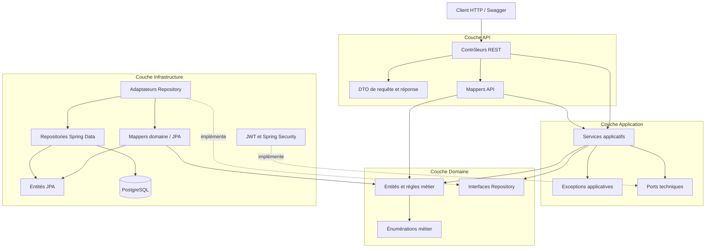
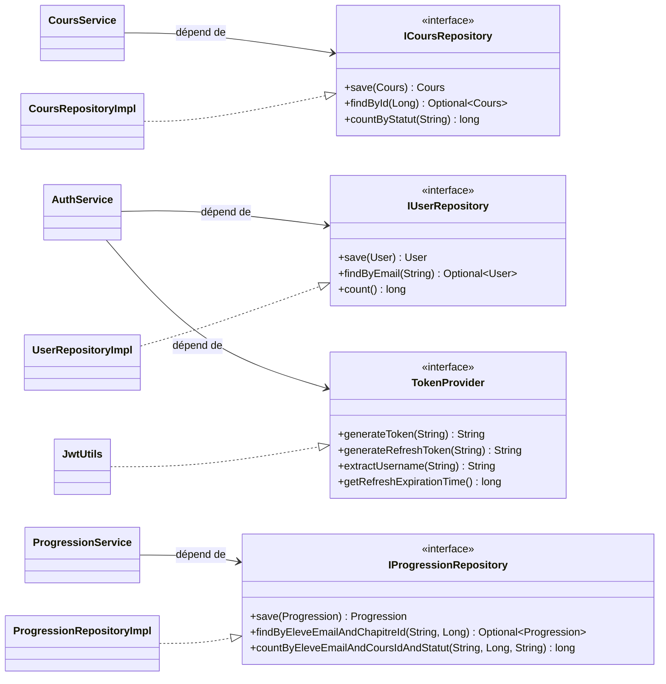

# Architecture du backend LearnHub

Ce document présente l'analyse de l'existant, l'architecture retenue, les
refactorisations réalisées et la stratégie de tests du backend LearnHub.

## 1. Analyse critique de l'existant

### Problèmes initiaux

La première version du backend présentait plusieurs formes de couplage :

- les contrôleurs manipulaient directement des objets métier et concentraient
  une partie de la conversion HTTP ;
- les services pouvaient dépendre de détails techniques, notamment du JWT et
  des réponses HTTP ;
- l'accès aux données n'était pas clairement séparé de la logique métier ;
- les entités du domaine contenaient surtout des données et peu de
  comportements ;
- la couverture de tests concernait principalement les contrôleurs.

Ces choix rendaient les modifications plus risquées. Un changement de
persistance, de format HTTP ou de mécanisme d'authentification pouvait se
propager dans plusieurs couches.

### État actuel

Le backend est maintenant organisé en quatre couches :

| Couche | Responsabilité | Exemples |
| --- | --- | --- |
| API | Reçoit les requêtes HTTP, valide les DTO et construit les réponses | contrôleurs, DTO, mappers API |
| Application | Orchestre les cas d'utilisation et les transactions | `CoursService`, `AuthService`, `ProgressionService` |
| Domaine | Porte les objets métier et définit les abstractions nécessaires | modèles, statuts, interfaces de repository |
| Infrastructure | Implémente les détails techniques | JPA, PostgreSQL, JWT, Spring Security |

Les dépendances principales vont de l'extérieur vers le domaine :

- l'API dépend de l'application ;
- l'application dépend du domaine et de ses interfaces ;
- l'infrastructure dépend du domaine pour implémenter ses interfaces ;
- le domaine ne dépend ni de l'API, ni de JPA, ni de Spring.

### Points positifs

- Les modèles du domaine sont séparés des entités JPA.
- Les repositories utilisés par les services sont des interfaces du domaine.
- Les DTO HTTP sont confinés dans la couche API.
- Les exceptions applicatives ne transportent plus de statut HTTP.
- `TokenProvider` inverse la dépendance entre l'authentification et le JWT.
- `Progression` porte désormais les transitions métier `demarrer()` et
  `terminer()`.
- Les repositories disposent de tests d'intégration sur une base H2 isolée.

### Limites restantes

L'architecture est nettement améliorée, mais elle n'est pas encore totalement
hexagonale :

- certains services applicatifs utilisent encore directement des types Spring,
  par exemple `PasswordEncoder`, `AuthenticationManager` et
  `@Transactional` ;
- quelques mappers API convertissent directement des modèles du domaine, ce qui
  crée une dépendance API vers domaine en plus du chemin API vers application ;
- `CustomUserDetailsService` est placé dans `application` alors qu'il adapte le
  domaine à Spring Security et pourrait rejoindre l'infrastructure ;
- `GlobalExceptionHandler` traite des concepts HTTP mais se trouve dans
  `infrastructure.config` ; un package API dédié serait plus cohérent ;
- plusieurs modèles restent anémiques et exposent des setters publics générés
  par Lombok ;
- les interfaces de repository utilisent encore des chaînes pour certains
  statuts au lieu des énumérations métier ;
- les tests d'intégration utilisent H2 alors que la production utilise
  PostgreSQL : quelques différences SQL peuvent donc ne pas être détectées.

Ces limites ne remettent pas en cause la séparation actuelle, mais constituent
les prochaines améliorations possibles.

## 2. Diagramme des quatre couches



La flèche en pointillés signifie « implémente une interface ». Le domaine ne
connaît pas les classes d'infrastructure qui réalisent ces contrats.

## 3. Interfaces et dépendances principales



Le même pattern est appliqué à `Chapitre`, `Inscription`, `Messagerie`,
`Ressource` et `RefreshToken`.

## 4. Argumentation des refactorisations

### Séparation des DTO et du domaine

Les objets reçus ou renvoyés par HTTP appartiennent à l'API. Les services
exposent des commandes et résultats applicatifs lorsqu'une conversion est
nécessaire, tandis que les mappers API effectuent la conversion. Quelques
mappers utilisent encore directement un modèle du domaine ; cette limite est
identifiée dans l'analyse et pourra être supprimée progressivement.

**Justification :** un changement de JSON ou de version d'API ne doit pas
modifier les entités métier.

### Introduction du pattern Repository

Les interfaces `IUserRepository`, `ICoursRepository`,
`IProgressionRepository`, etc. sont définies dans le domaine. Les classes
`*RepositoryImpl` de l'infrastructure les implémentent avec Spring Data JPA.

**Justification :** les cas d'utilisation dépendent d'abstractions. La base de
données peut être remplacée et les services peuvent être testés avec des mocks
sans démarrer Spring ni une base réelle.

### Séparation des modèles métier et JPA

Les classes de `domain.model` ne contiennent aucune annotation JPA. Les classes
de `infrastructure.persistence.entity` décrivent uniquement le stockage, et
des mappers assurent la conversion.

**Justification :** le modèle métier reste testable en Java pur et ne dépend
pas du schéma relationnel.

### Découplage des services et de HTTP

Les services lèvent des exceptions applicatives telles que
`ResourceNotFoundException`, `AccessDeniedException` et
`BusinessRuleException`. `GlobalExceptionHandler` les convertit ensuite en
codes HTTP.

**Justification :** le choix d'un statut HTTP relève de l'adaptateur web, pas
de la logique applicative. Les mêmes services pourraient ainsi être appelés
par une interface en ligne de commande ou un traitement asynchrone.

### Inversion de dépendance pour le JWT

`AuthService` dépend du port `TokenProvider`. `JwtUtils`, situé dans
l'infrastructure, implémente ce port avec la bibliothèque JJWT.

**Justification :** l'application exprime son besoin de produire et lire des
jetons sans connaître la bibliothèque ni la configuration JWT.

### Enrichissement du domaine

La transition d'une progression vers `EN_COURS` ou `TERMINE` est maintenant
réalisée par `Progression.demarrer()` et `Progression.terminer()`. L'entité
garantit simultanément le statut, le pourcentage et les dates.

**Justification :** une règle métier atomique ne doit pas être reconstruite
dans chaque service. Cela évite les états incohérents comme une progression
terminée avec un pourcentage inférieur à 100.

## 5. Stratégie de tests

La stratégie suit les trois niveaux demandés par le sujet.

### Tests unitaires du domaine

Les tests de `domain.model` exécutent les règles métier sans Spring et sans
base de données. Par exemple, `ProgressionTest` vérifie que :

- `demarrer()` produit le statut `EN_COURS` et initialise les dates ;
- `terminer()` produit le statut `TERMINE`, fixe le pourcentage à 100 et
  renseigne la date de fin.

**Pourquoi :** ces tests sont rapides, isolés et localisent précisément une
régression métier.

### Tests unitaires des services

Les tests de `application` utilisent Mockito pour remplacer les interfaces de
repository. Ils vérifient l'orchestration, les contrôles d'accès, les calculs
et les objets transmis aux ports.

**Pourquoi :** la logique applicative est testée sans dépendre de Spring Data,
du réseau ou d'une base.

### Tests d'intégration des repositories

`RepositoryIntegrationTest` démarre une tranche JPA avec `@DataJpaTest` et une
base H2. Il vérifie les requêtes personnalisées, les jointures, les filtres,
les tris et les comptages de plusieurs repositories.

**Pourquoi :** un mock ne peut pas valider une requête JPQL, un mapping JPA ou
une relation entre entités.

### Tests API

Les tests de contrôleurs vérifient les endpoints, la sérialisation JSON, la
sécurité et la traduction des erreurs en réponses HTTP.

**Pourquoi :** ils contrôlent que les couches coopèrent correctement depuis
l'entrée HTTP jusqu'aux services et, selon le test, jusqu'à la persistance.

### Répartition et exécution

Le projet contient actuellement :

- 3 classes de tests du domaine ;
- 3 classes de tests applicatifs ;
- 1 classe de tests d'intégration des repositories ;
- 10 classes de tests API ;
- 1 test de chargement du contexte Spring.

Commande de validation :

```bash
./mvnw test
```

Au dernier contrôle, la suite complète exécutait 58 tests sans échec.

### Limites et évolutions de la stratégie

Pour se rapprocher davantage de l'environnement de production, les tests JPA
pourraient ensuite utiliser PostgreSQL avec Testcontainers. Des tests
d'architecture ArchUnit pourraient aussi interdire automatiquement les
dépendances du domaine vers Spring, JPA, l'API ou l'infrastructure.

## 6. Conclusion

La refactorisation répond aux objectifs principaux du sujet : responsabilités
séparées, dépendances orientées vers les abstractions, domaine indépendant des
détails techniques et tests répartis selon les couches. Les limites restantes
sont identifiées explicitement afin de ne pas présenter l'architecture comme
achevée alors que des améliorations sont encore possibles.
